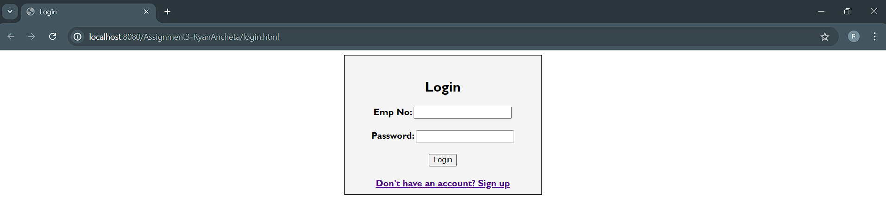
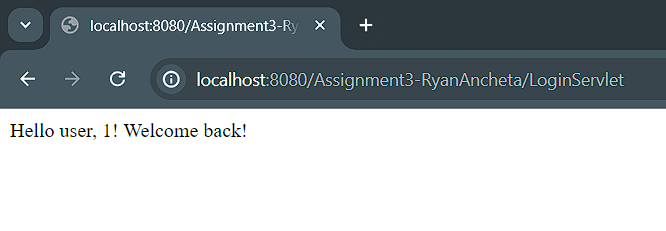

# Employee Management System

A web-based application for managing employee records, featuring user registration and login. Includes a user-friendly interface for sign-up and secure login. The backend uses Java Servlets to process form submissions and connects to a MySQL database for efficient and secure data management.

## Features

- **User Registration**: New employees can sign up by providing their details.
- **User Login**: Existing employees can log in securely using their employee number and password.
- **Data Management**: All employee information is stored in a MySQL database, ensuring data security and efficiency.

## Screenshots


*Login Screen: Employees can log in with their employee number and password.*


*Welcome Screen: Basic welcome page with their empployee no.*


*Registration Screen: New employees can sign up by filling out the form.*


*Registration Success Screen: When registration is successfull user will be redirected to log in page.*

## Getting Started

### Prerequisites

- Java Development Kit (JDK)
- Apache Tomcat Server
- MySQL Database

### Installation

1. **Clone the repository**:
    ```bash
    git clone https://github.com/yourusername/employee-management-system.git
    ```
2. **Set up the MySQL database**:
    ```sql
    CREATE DATABASE employee_management;
    USE employee_management;
    CREATE TABLE employees (
        id INT AUTO_INCREMENT PRIMARY KEY,
        emp_name VARCHAR(100),
        emp_no VARCHAR(50),
        password VARCHAR(50),
        gender VARCHAR(10),
        emp_job VARCHAR(50),
        department VARCHAR(50)
    );
    ```

3. **Update the database configuration in the Java files**:
    - Update the database URL, username, and password in `Insert_Form_Records.java` and `LoginServlet.java`.

4. **Deploy the application on Apache Tomcat**:
    - Place the HTML files (`login.html` and `Register_Form.html`) in the `webapps/ROOT` directory of your Tomcat server.
    - Place the Java servlet files (`Insert_Form_Records.java` and `LoginServlet.java`) in the appropriate directory for Java classes in your Tomcat project structure. Typically, this is under `WEB-INF/classes/`.

5. **Compile the Java servlets**:
    - Ensure your Java servlets are compiled. This may require setting up a build tool like Maven or manually compiling them.

6. **Start the Tomcat server**:
    - Start your Apache Tomcat server.

7. **Access the application**:
    - Open a web browser and go to `http://localhost:8080/`.
## Usage

1. **Register a new employee**:
    - Go to the registration page and fill out the form.
    - Submit the form to register the employee.

2. **Login as an existing employee**:
    - Go to the login page.
    - Enter your employee number and password to log in.

## Contributing

Contributions are welcome! Please fork the repository and submit a pull request for any improvements.
